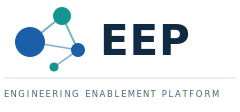

  

<h1 align="center">Next.js Template</h1>

  
  
  
  
  

A production-grade Next.js scaffold built on [Engineering Enablement Platform
(EEP)](https://github.com/your-org/eep) principles. Ships full - authentication,
database, API docs, logging, and conventions all wired and demonstrated - so you
can strip what you don't need rather than bolt on what you do.
